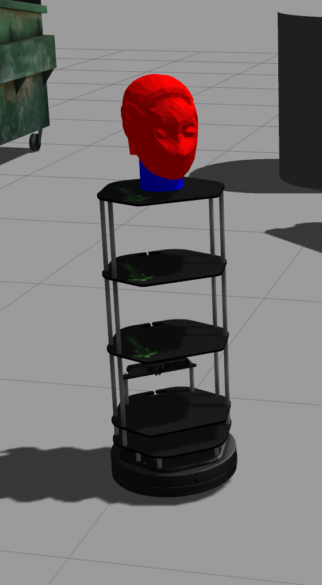

<!-- [![Contributors][contributors-shield]][contributors-url] -->
<!-- [![Forks][forks-shield]][forks-url] -->
<!-- [![Stargazers][stars-shield]][stars-url] -->
<!-- [![Issues][issues-shield]][issues-url] -->
<!-- [![MIT License][license-shield]][license-url] -->
<!-- [![LinkedIn][linkedin-shield]][linkedin-url] -->


<!-- PROJECT LOGO -->
<div align="center">
  <a href="https://github.com/alexoterno/turtlebot2_with_head">
    
  </a>

  <h3 align="center">turtlebot2_with_head</h3>

  <div align="center">
    This repository contains the turtlebot2 robot on ROS Melodic with the ARI Head
    <br />
    <a href="https://github.com/alexoterno/turtlebot2_with_head"><strong>Explore the docs »</strong></a>
    <br />
    <br />
    <a href="https://github.com/alexoterno/turtlebot2_with_head">View Demo</a>
    ·
    <a href="https://github.com/alexoterno/turtlebot2_with_head/issues">Report Bug</a>
    ·
    <a href="https://github.com/alexoterno/turtlebot2_with_head/pulls">Request Feature</a>
  </div>
</div>

<!-- TABLE OF CONTENTS -->
## Table of Contents
* [About the Project](#about-the-project)
  * [Package Description](#package-description)
    * [head_src](#head_src)
    * [inria_src](#inria_src)
    * [turtlebot2_src](#turtlebot2_src)
* [Getting Started](#getting-started)
  * [Prerequisites](#prerequisites)
  * [Installation](#installation)
* [Usage](#usage)
* [Roadmap](#roadmap)
* [Contributing](#contributing)
* [License](#license)
* [Contact](#contact)
* [Acknowledgements](#acknowledgements)

## About the Project
This repository contains the turtlebot2 robot for ROS Melodic version of ROS with the [ARI head](http://wiki.ros.org/Robots/ARI/Tutorials).
A plate on the top of the basic [turtlebot2](http://wiki.ros.org/Robots/TurtleBot) was added (the third one) to increase the height of the robot. On top of this, the head of the ARI robot was put.

### Package Description

#### head_src
This package contains the packages for the ARI Head and the [robotis_op3](http://wiki.ros.org/robotis_op3) head (now, it's deprecated).
Regarding the ARI head packages, the description files can be found in the [ari_description](https://github.com/alexoterno/turtlebot2_with_head/tree/master/src/head_src/src/ari_head/ari_description) package. The [controller_manager](https://github.com/alexoterno/turtlebot2_with_head/tree/master/src/head_src/src/ari_head/controller_manager) and [controller_manager_msgs](https://github.com/alexoterno/turtlebot2_with_head/tree/master/src/head_src/src/ari_head/controller_manager_msgs) packages are used to control the head.

#### inria_src
The custom_launchers, ros_controllers_redefined and visual_servoing packages are in this source folder. There are used to spawn the robot and launch only the sensors and controllers that are needed for visual navigation tasks. For the moment, there ares only the head controller (pan/tilt) and the mobile base controller.
The visual_servoing package is a visual servoing implementation based on the [Visual Servoing Platform](https://visp-doc.inria.fr/doxygen/visp-daily/). The [visp](https://visp.inria.fr/download/) librairy need to be installed on your computer.

#### turtlebot2_src
This source folder contains the basic [Turtlebot2](https://github.com/gaunthan/Turtlebot2-On-Melodic) sources that can be run on ROS Melodic.

<!-- GETTING STARTED -->

## Getting Started
To run the Turtlebot2-with-head simulation, follow these simple steps.

### Prerequisites
Tu run Turtlebot2-with-head simulation, you need to install the robotic middleware ROS Melodic (related to Ubuntu 18.04) and the Simulator Gazebo. You can install them on your local machine or on a virtual machine):
* [ROS Melodic](http://wiki.ros.org/melodic/Installation)
* [Gazebo](http://gazebosim.org/tutorials?tut=install_ubuntu)


### Installation
1. Clone the GitHub repository
  ```sh
  git clone https://github.com/alexoterno/turtlebot2_with_head
  ```
  2. Do a make and source your workspace
  ```sh
  cd /path/to/your/turtlebot2_with_head
  catkin_make
  source /opt/ros/melodic/setup.bash
  source devel/setup.bash
  ```

<!-- USAGE EXAMPLES -->
## Usage
Here, you can find an example of how to run the simulation.
Open a terminal and type :
```sh
source /opt/ros/melodic/setup.bash
source /path/to/your/turtlebot2_with_head/devel/setup.bash
export ROS_MASTER_URI=http://localhost:11350
sh /path/to/your/turtlebot2_with_head/src/inria_src/src/custom_launchers/launch/gazeboSim0.sh
```
If you want to activate the GUI interface of Gazebo, add "-g"
```sh  
sh /path/to/your/turtlebot2_with_head/src/inria_src/src/custom_launchers/launch/gazeboSim0.sh -g
```
See the [*gazeboSim0.sh*](https://github.com/alexoterno/turtlebot2_with_head/blob/master/src/inria_src/src/custom_launchers/launch/gazeboSim0.sh) file, to know all the arguements that can be passed
**Now, your turtlebot2_with_head simulation is running** on ROS Melodic.
Congratulations !

<!-- ROADMAP -->
## Roadmap

See the [open issues](https://github.com/alexoterno/turtlebot2_with_head/issues) for a list of proposed features (and known issues).


<!-- CONTRIBUTING -->
## Contributing

Contributions are what make the open source community such an amazing place to be learn, inspire, and create. Any contributions you make are **greatly appreciated**.

1. Fork the Project
2. Create your Feature Branch (`git checkout -b feature/AmazingFeature`)
3. Commit your Changes (`git commit -m 'Add some AmazingFeature'`)
4. Push to the Branch (`git push origin feature/AmazingFeature`)
5. Open a Pull Request


<!-- LICENSE -->
## License

<!-- Distributed under the MIT License. See `LICENSE` for more information. -->


<!-- CONTACT -->
## Contact

Alex Auternaud  - alex.auternaud07@gmail.com<br/>
Project Link: [https://github.com/alexoterno/turtlebot2_with_head](https://github.com/alexoterno/turtlebot2_with_head)<br/>


<!-- ACKNOWLEDGEMENTS -->
## Acknowledgements

* []()
* []()
* []()


<!-- MARKDOWN LINKS & IMAGES -->
<!-- https://www.markdownguide.org/basic-syntax/#reference-style-links -->
<!-- [contributors-shield]: https://img.shields.io/github/contributors/othneildrew/Best-README-Template.svg?style=flat-square -->
<!-- [contributors-url]: https://gitlab.inria.fr/perception-ral/ari_spring_project/-/project_members -->
<!-- [forks-shield]: https://img.shields.io/github/forks/othneildrew/Best-README-Template.svg?style=flat-square -->
<!-- [forks-url]: https://gitlab.inria.fr/perception-ral/ari_spring_project/-/forks/new -->
<!-- [stars-shield]: https://img.shields.io/github/stars/othneildrew/Best-README-Template.svg?style=flat-square -->
<!-- [stars-url]: https://gitlab.inria.fr/perception-ral/ari_spring_project/-/starrers -->
<!-- [issues-shield]: https://img.shields.io/github/issues/othneildrew/Best-README-Template.svg?style=flat-square -->
<!-- [issues-url]: https://gitlab.inria.fr/perception-ral/ari_spring_project/-/issues -->
<!-- [license-shield]: https://img.shields.io/github/license/othneildrew/Best-README-Template.svg?style=flat-square -->
<!-- [license-url]: https://github.com/othneildrew/Best-README-Template/blob/master/LICENSE.txt -->
<!-- [linkedin-shield]: https://img.shields.io/badge/-LinkedIn-black.svg?style=flat-square&logo=linkedin&colorB=555 -->
<!-- [linkedin-url]: https://linkedin.com/in/othneildrew -->
<!-- [product-screenshot]: images/screenshot.png -->
